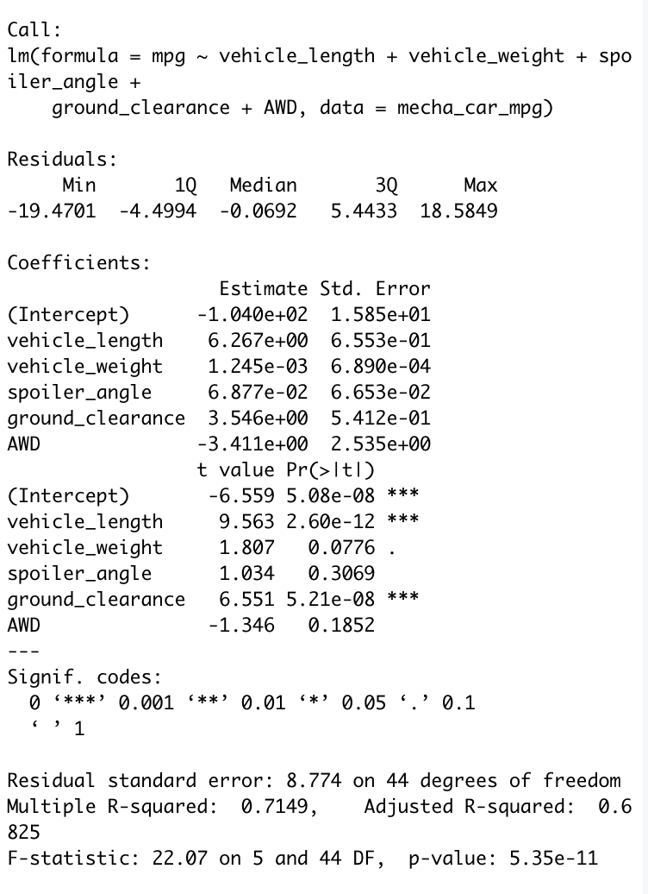
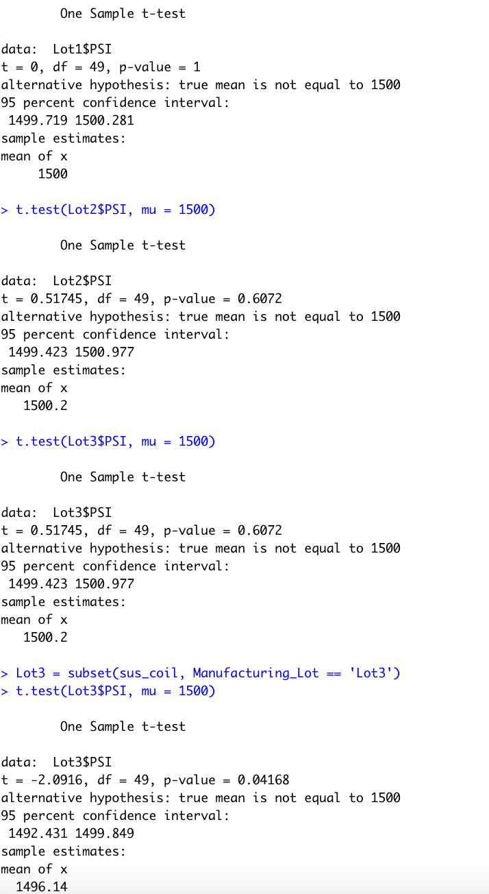

# MechaCar Statistical Analysis

## Languages used
• R

## Purpose and Overview

The objective of this project is to leverage the power of R programming language to conduct a comprehensive analysis and evaluation of various factors that can impact the performance of new MechaCar prototypes. The project aims to measure and compare the performance of these prototypes based on several key factors, including weight, length, spoiler angle, ground clearance, all-wheel drive (AWD) capabilities, miles per gallon (MPG), and pounds per square inch (PSI).

By utilizing R, we can efficiently analyze the data associated with these factors and gain insights into their influence on the performance of the MechaCar prototypes. The analysis will involve measuring the impact of each factor individually and collectively on the overall performance of the vehicles. This will enable us to identify significant correlations, evaluate the relative importance of each factor, and assess their combined effects on vehicle performance.

The factors being considered, such as weight, length, spoiler angle, ground clearance, AWD capabilities, MPG, and PSI, provide a comprehensive framework for comparing and contrasting the performance attributes of the MechaCar prototypes. Through this analysis, we aim to provide valuable insights and inform decision-making processes regarding the design, optimization, and enhancement of the MechaCar prototypes, ultimately contributing to the development of high-performance vehicles.

## Linear Regression to Predict MPG

1. The vehicle length and ground clearance variables provided a non-random amount of variance to the mpg values
2. The slope is not considered to be zero because the p-value is so small and we can easily reject the null hypothesis
3. The linear model does a good job predicting mpg due to the adjusted R-squared being not too far off from the Multiple R-squared

## T-test on Suspension Coils

Conducting a t-test, we find the p-values of the three lots

• Lot 1 has a p-value of 1, higher than the significance level of 0.05. Because of this, we fail to reject the null hypothesis.

• Lot 2 has a p-value of 0.6072, and so because of this, we fail to reject the null hypothesis

• Lot 3 has a p-value of 0.04168. Because this value is lower than the significance level of 0.05, we can reject the null hypothesis.

## Summary Statistics on Suspension Coils

From the results we can see that overall, the manufacturing data meets the requirement that suspension coils must not exceed 100 pounds per square inch. However, when separated into 3 lots, the first and second lots show little variance; however, the third lot's variance far exceeds the limit.

## Study Design: MechaCar vs Competition

Another statistical test that we can employ to compare MechaCar vehicles against those of other manufacturers is comparing the maintenance cost of each company's vehicles.

• For this test, we can test for long term cost of maintenance over a span of 5 years

• The null hypothesis is that there is no difference in maintenance cost between MechaCar vehicles and those of other companies. The alternative hypothesis is that there is a difference.

• For this test, we would use a linear regression line similar to the one used in this test.

• The data for this test would include vehicle weight, vehicle length, and mpg.
